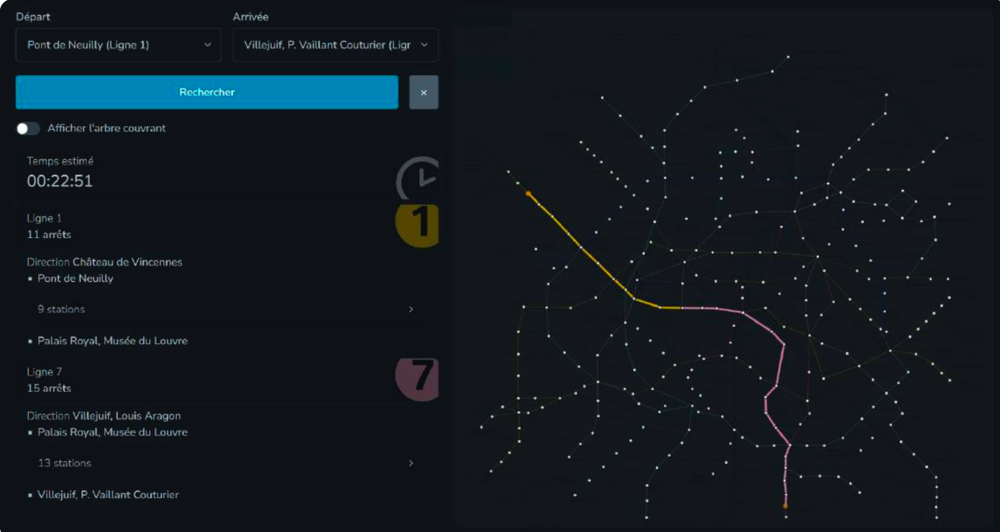
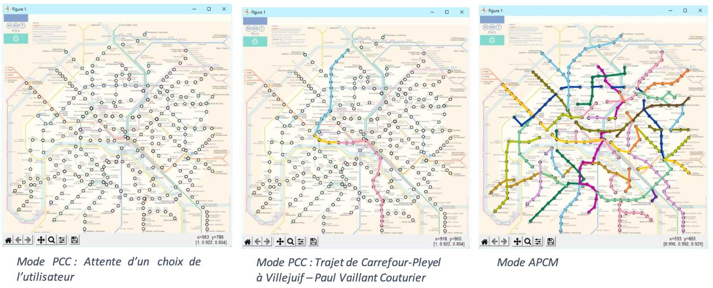

***Solution Factory   : Efrei,  2024***

***Projet filière IT :  Métro, Efrei, Dodo***

***Auteur : Youssef Ait El Mahjoub***
 

--------------
#  Version 1: 

- Voir le dossier "/Version1"
- Date des données : 1998 - 2002, de durées approximative entre les stations mais réaliste.
- Données centralisés dans un seul fichier "metro.txt", et un autre fichier "pospoint.txt" pour la position des points en 
  pixel dans l'image fournie.
- Données exploitable directement (sommets et arrêtes) pour la construction du graphe non-orienté.
- Il va falloir peut être nettoyer une chose ou deux dans les données, je vous laisse explorer.

- "metro.txt" : contient les informations des stations et connexions entre stations.
  -> Format pour les sommets :
    V num_sommet nom_sommet numéro_ligne si_terminus branchement (0 stations en commun, 1 pour la direction 1,  2 pour la direction 2, ainsi de suite ...)
  -> Format pour les arrêtes :
    E num_sommet1 num_sommet2 temps_en_secondes 
- "pospoint.txt" : contient les positions des stations, pour l'affichage dans le plan parisien.
 
 

-------------------------
#   Version 2 et Version 3:  

## I - Provenance : 

- Voir le dossier "/Version2_Version3"
- Source des données : Ile-de-France Mobilité (IDFM)
- Page officielle des donnés GTFS : https://data.iledefrance-mobilites.fr/explore/dataset/offre-horaires-tc-gtfs-idfm/information/
- Date des données de ce dossier  : 02/03/2024
- Données temps réel et trés détaillés, nécessite la manipulation de plusieurs fichiers (GTFS) pour extraire les informations 
  nécessaire pour construire le graphe.

## II - Les fichiers :

- Les fichiers fournis GTFS/IDFM sont:
	- "agency.txt"
	- "routes.txt"
	- "trips.txt"
	- "stop.txt"
	- "stop_times.txt"
	- "stop_extensions.txt"
	- "transfers.txt"
	- "calendar.txt"
	- "calendar_dates.txt"
	- "pathways.txt"

## III - Explication des fichiers : 

- Le fichier "opendata_gtfs.pdf" fourni une explication des fichiers et la connexion entre ces derniers.
- Fichier pdf à lire impérativement (slide 17 primordiale).

Détails supplémentaires : 

- "agency.txt" contient le nom des différentes agences (ou entreprises de transports) en leur attribuant un identifiant.
Exemple : "RATP" est identifié par "DFM:Operator_100", "RER" par "IDFM:71", "Transilien" par "IDFM: 1046" ... etc

- "routes.txt" : permet d'identifier toutes les lignes de transport d'une agence, comme les lignes de métro, rer, bus, ...
  Exemple : 
		- La "RATP" identifié par "DFM:Operator_100", posséde une ligne M1 identifié par "IDFM:C01371", une ligne M2
		  identifié par "IDFM:C01372" ... il y'a aussi des bus et autres. Donc la "route_id" est juste l'identifiant d'une ligne X 
		  qui fait partie d'une agence Y. La colonne "type" permet de savoir si c'est "metro|RER|BUS ..."
		- Le "Transilien" identifié par "IDFM: 1046", posséde la ligne "L" identifié par "IDFM:C01847", la ligne "J" identifié
		  par "IDFM:C01846" ... etc

- "trips.txt": est un fichier de liaison entre plusieurs autres (voir "opendata_gtfs.pdf", slide 17).
  Ce fichier permet de lier une "route_id" (donc une ligne de transport), avec un "trip_id" exploitable dans le fichier 
  "stop_times.txt" (pour connaitre les moments d'arrêt de la ligne en question dans ces différentes stations), également "service_id" est exploitable dans "calendar.txt" et "calendar_dates.txt".

- "stops.txt" en ayant le "stop_id" de "trips.txt", on obtient le nom de la station en question et d'autres détails 
  (géolocalisation, parent station = nom commercial de la station, exemple : Boieldieu, Grande-arche, Dôme-Valmy ... = la Défense). 

- "stop_times.txt" : fichier assez lourd (675 Mo), en connaisant le "trip_id" de "trips.txt" qui fait référence à une course, on 
  peut obtenir la date d'arrivée et la date de départ d'une ligne à une station (qui sont identiques ... pas réaliste, on peut compter 10 secondes de temps dans chaque arrêt). Fichier important car c'est d'ici qu'on doit extraire les poids (la durée entre 2 stations) des arrêtes du graphe. 

=> Exemple : on veut connaitre les moments de passage de la ligne 11.

- On sait que la ligne 11 est dans l'agence "RATP" identifiée par "DFM:Operator_100"
- On va chercher dans "routes.txt", la 11 est identifiée par "IDFM:C01381" qui est donc le "route_id"
- Ensuite dans "trips.txt", on chercher "IDFM:C01381", il y'en a plusieurs ... je choisi le trip_id "IDFM:RATP:127519-C01381-COU_RATP_5094171_2467825_2" qui fait reference à "Mairie des Lilas".
- Ensuite on recherche ce trip_id dans le fichier "stops_times.txt" on trouve : 
    > IDFM:RATP:127519-C01381-COU_RATP_5094171_2467825_2,05:38:00,05:38:00,IDFM:463079,0,0,1,,,1  (Ici c'est châtelet)

    > IDFM:RATP:127519-C01381-COU_RATP_5094171_2467825_2,05:39:00,05:39:00,IDFM:21990,1,0,0,,,1   (Ici c'est Hotel de Ville)

    > IDFM:RATP:127519-C01381-COU_RATP_5094171_2467825_2,05:40:00,05:40:00,IDFM:462945,2,0,0,,,1  (Ici c'est Rambuteau)

    > IDFM:RATP:127519-C01381-COU_RATP_5094171_2467825_2,05:41:00,05:41:00,IDFM:21997,3,0,0,,,1   (Ici c'est Art et metier)
  
    > IDFM:RATP:127519-C01381-COU_RATP_5094171_2467825_2,05:42:00,05:42:00,IDFM:462960,4,0,0,,,1  (Ici c'est Republique)

    > IDFM:RATP:127519-C01381-COU_RATP_5094171_2467825_2,05:44:00,05:44:00,IDFM:463187,5,0,0,,,1   ...

    > IDFM:RATP:127519-C01381-COU_RATP_5094171_2467825_2,05:45:00,05:45:00,IDFM:21998,6,0,0,,,1    ...

    > IDFM:RATP:127519-C01381-COU_RATP_5094171_2467825_2,05:46:00,05:46:00,IDFM:21991,7,0,0,,,1    ... 

    > IDFM:RATP:127519-C01381-COU_RATP_5094171_2467825_2,05:47:00,05:47:00,IDFM:463192,8,0,0,,,1   ...

    > IDFM:RATP:127519-C01381-COU_RATP_5094171_2467825_2,05:48:00,05:48:00,IDFM:463254,9,0,0,,,1   ...

    > IDFM:RATP:127519-C01381-COU_RATP_5094171_2467825_2,05:49:00,05:49:00,IDFM:463319,10,0,0,,,1  ... 

    > IDFM:RATP:127519-C01381-COU_RATP_5094171_2467825_2,05:51:00,05:51:00,IDFM:21949,11,0,0,,,1   ...

    > IDFM:RATP:127519-C01381-COU_RATP_5094171_2467825_2,05:53:00,05:53:00,IDFM:463223,12,1,0,,,1  (Enfin, Mairi des Lilas aprés 15min)

- La première ligne indique, une arrivé ensuite depart à "05:38:00, 05:38:00" à la station "IDFM:463079" qui correspond à ... en faisant une recherche dans "stops.txt" on réalise que c'est la station de "Chatelet". Donc il reste juste à connaitre les noms des stations (voir dernière colonne ci-dessus).

- On peut également chercher les horaires du dernier métro de la ligne 11 à partir de châtelet (astuce: on modifie juste le dernier nombre du trip id). Alors l'identifiant est "IDFM:RATP:127519-C01381-COU_RATP_5094171_2467825_352", les horaires donc:
    > DFM:RATP:127519-C01381-COU_RATP_5094171_2467825_352,24:56:00,24:56:00,IDFM:463079,0,0,1,,,1   (Ici c'est châtelet)

    > IDFM:RATP:127519-C01381-COU_RATP_5094171_2467825_352,24:57:00,24:57:00,IDFM:21990,1,0,0,,,1

    > IDFM:RATP:127519-C01381-COU_RATP_5094171_2467825_352,24:58:00,24:58:00,IDFM:462945,2,0,0,,,1

    > IDFM:RATP:127519-C01381-COU_RATP_5094171_2467825_352,24:59:00,24:59:00,IDFM:21997,3,0,0,,,1

    > IDFM:RATP:127519-C01381-COU_RATP_5094171_2467825_352,25:01:00,25:01:00,IDFM:462960,4,0,0,,,1

    > IDFM:RATP:127519-C01381-COU_RATP_5094171_2467825_352,25:02:00,25:02:00,IDFM:463187,5,0,0,,,1

    > IDFM:RATP:127519-C01381-COU_RATP_5094171_2467825_352,25:03:00,25:03:00,IDFM:21998,6,0,0,,,1

    > IDFM:RATP:127519-C01381-COU_RATP_5094171_2467825_352,25:04:00,25:04:00,IDFM:21991,7,0,0,,,1

    > IDFM:RATP:127519-C01381-COU_RATP_5094171_2467825_352,25:05:00,25:05:00,IDFM:463192,8,0,0,,,1

    > IDFM:RATP:127519-C01381-COU_RATP_5094171_2467825_352,25:06:00,25:06:00,IDFM:463254,9,0,0,,,1

    > IDFM:RATP:127519-C01381-COU_RATP_5094171_2467825_352,25:08:00,25:08:00,IDFM:463319,10,0,0,,,1

    > IDFM:RATP:127519-C01381-COU_RATP_5094171_2467825_352,25:09:00,25:09:00,IDFM:21949,11,0,0,,,1

    > IDFM:RATP:127519-C01381-COU_RATP_5094171_2467825_352,25:11:00,25:11:00,IDFM:463223,12,1,0,,,1 (Enfin, Mairie des Lilas aprés 15min)

Attention 24:56 signifie 00:56, de même 25:06 signifie 01:06 du matin. Oui pas naturel, mais ça simplifie la vie côté Dev 
(evidement l'utilisateur ne voit pas les coulisses). Cela permet d'éviter de créer et scinder la course à minuit.

- Voir le fichier "Ligne_M7.md", pour voir l'exemple de la ligne 7.

- "transferts.txt" : fichier qui fournis les temps de correspondances entres les arrêts.
 Exemple la ligne : "IDFM:482774,IDFM:486056,2,310" nous informe d'une correspondance de minimuim 310 secondes entre
 La station "IDFM:482774" donc châtelet (en recherchant dans "stop.txt") à une autre station "IDFM:486056" toujours à chatelet.
 En faisant du backtracking, on trouve que "IDFM:482774" correspond par exemple à un trip_id "IDFM:RATP:128749-C01109-COU_RATP_5088804_2747215_55" dans "stop_times.txt", qui fait reference à la route "IDFM:C01109" dans "trip.txt", qui correspond au "Bus 74". De la même façon on trouve que "IDFM:486056" correspond au "Bus N22". Donc la correspondance à Chatelet entre ces deux lignes de Bus dure au minimuim 310 secondes.

- Les quatres autres fichiers restant ne semble pas nécessaire, pour les plus motivés libre à vous de rajouter les calendrier des
  dates et d'autres niveaux de granularité des données pour avoir des bonus.
 
 

-------------------------
#  Remarques importantes :  

- Pour créer votre graphe, on doit connaitre les stations qui sont les noeuds, le poids entre les noeuds qui va être la durée 
  (en seconde) entre 2 stations. 
- Dans la Version 1 et Version 2 : On ne soucis pas de la date d'arrivé des lignes. On ne considére que les durées entre stations. Dans
  ces deux versions, on suppose que l'utilisateur arrive à la station exactement au moment de passage de sa ligne de transport et que les correspondences se font dans des temps négligales ( = 0 ). 

- Version 1 : On utilise un autre fichier de donnée plus simple et qui centralise toutes les données, mais le fichier date de 
  1998 - 2002.
- Version 2 : On utilise des données réels issue de IDFM 2024, comme expliqués ci-dessus.  
  Vue que la durée entre deux stations ne changent pas le long de la journée. Ce qui veut dire que dans "stop_times.txt", pas la peine de trouver les 351 trajets que fait la ligne 11 (la ligne 11 c'est juste un exemple pour expliquer) pour avoir la durée et faire une moyenne. Il suffit de trouver un seul trip de la 11, déduire les durées entre les stations, les rajouter dans le graphe ... de même pour les autres lignes. Faire attention aux branchements (c'est à dire les différentes directions).
- Version 3 : dans cette version, on doit respecter précisement les heures de départ des lignes dans chaque station. Donc un
  utilisateur peut attendre quelque temps pour le prochain passage de la ligne dans la station, de même pour les correspondances qui ne sont plus négligales (voir "transfert.txt").
- Toutes les versions : se limiter aux lignes de métros.
 
 

-------------------
#  Travail à faire :  

### A) Création du graphe valué à partir des données, en utilisant des structures de données adéquate.

### B) Créer un algorithme permettant de vérifier la connexité du réseau de transport.
    - (i.e. à partir de n'importe quelle station, on peut atteindre toutes les autres stations)
    - Votre application doit pouvoir proposer à l'utilisateur un bouton (ou autre) afin qu'il puisse vérifier la connexité du réseau.

### C) Implémenter un algorithme d'ACPM comme Kruskal, en V1 ou V2. 
    - Afficher l'arbre obtenu sur le plan du métro, ainsi que le poids de l 'arbre.
    - Votre application doit pouvoir proposer à l'utilisateur un bouton (ou autre) afin qu'il puisse observer l'ACPM se propager dans le réseau.

### D) Implémenter un algorithme de PCC comme Dijkstra, dans l'une des trois versions (par difficulté croissante): 
- V1 : Les données se trouvent dans "métro.txt", données directement exploitable. 
       Pas d'horaire exacte de passage des lignes.

- V2 : Les données sont à jours, proviennnent de "Ile-de-France Mobilité 2024", par contre nécessitent un pré-traitement 
       (voir explications ci-dessus). 
       Pas d'horaire exacte de passage des lignes. 

- V3 : V2 + respecter les horaires de passage des lignes et temps de correspondance dans chaque trajet (voir ci-dessus).
       Donc ici l'utilisateur défini non seulement la station de départ et arrivée, mais aussi la date de début de son trajet.

### E)  Développer une UI exploitable par un utilisateur qui voudrais rechercher son itineraire, afficher l'ACPM, ou verifier la connexité du réseau.
- Pour l'UI/UX la seule limite est votre imagination. Tant que l'application est fonctionnelle. 

Des bonus peuvent être attribués pour d'autres fonctionnalités: 
- Prendre en compte les lignes de Rer.
- Spécifier une date d'arrivé souhaité pour votre trajet (au lieu d'une date de départ).
- Considérer l'information d'accessibilité des stations pour les fauteuils roulant ...
 
 

-----------------
#  UI examples :  

 

    

 

    

 

    

 

    

 

-----------------
#  Bibliographie :  

- Les cours soumis sur Moodle.
- https://data.iledefrance-mobilites.fr/explore/dataset/offre-horaires-tc-gtfs-idfm/information/
- https://www.dericbourg.net/2015/12/10/calcul-ditineraire-a-partir-des-donnees-ratp/ 